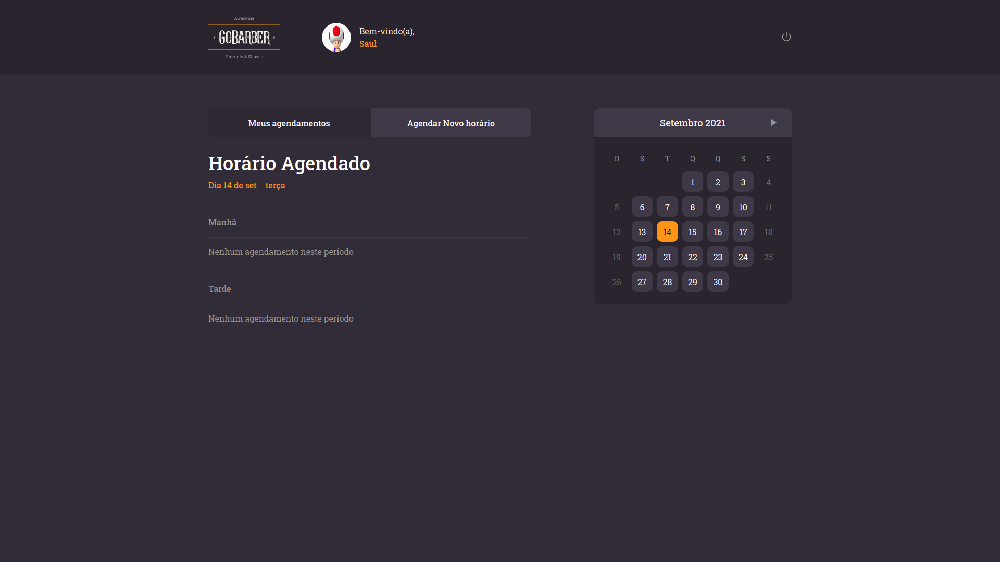
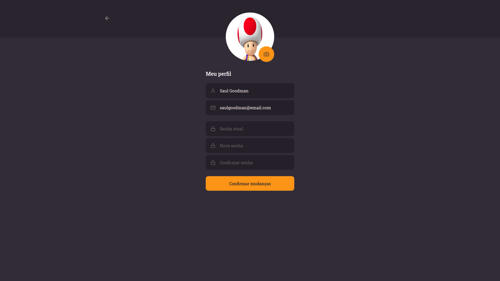

# GoBarber frontend (React.js)

Project developed during [Rocketseat](https://github.com/rocketseat-education) bootcamp

## Technology

- Javascript with Typescript
- ReactJs library

## Concepts and technologies applied in this project:

- Abstract the application into components
- Use of context to share data throughout the pages
- Password encryption
- Input data validation
- Automated tests with Jest framework
- Integration with REST API
- CSS and Styled-components

## Features included

- Upload of files
- Password encryption
- Filter appointments per date
- Set appoinment
- Change personal details
- Reset password

## List of pages

#### Login

### Dashboard

#### Profile

#### Signup

#### Reset Password

## List of services used in the application

| Name | Type | Description | Endpoint |
| ------------------- | ------------------- | ------------------- | ------------------- |
|  Users | `POST` | Register user | `hostURL`/users |
|  Users | `POST` | Autheticate user | `hostURL`/sessions |
|  Users | `POST` | Forgot password email | `hostURL`/password/forgot |
|  Users | `POST` | Reset password | `hostURL`/password/reset |
|  Users | `PATCH` | Update user's avatar | `hostURL`/users/avatar |
|  Users | `PUT` | Update profile | `hostURL`/profile |
|  Users | `GET` | Retrieve profile main data | `hostURL`/profile |
|  Appointments | `GET` | List all providers | `hostURL`/providers |
|  Appointments | `GET` | List provider appointments | `hostURL`/appointments/me |
|  Appointments | `GET` | List provider days Availability | `hostURL`/providers/`:id`/day-availability |
|  Appointments | `GET` | List providers Month Availability | `hostURL`/providers/`:id`/month-availability |
|  Appointments | `POST` | Create appointment | `hostURL`/appointments |
